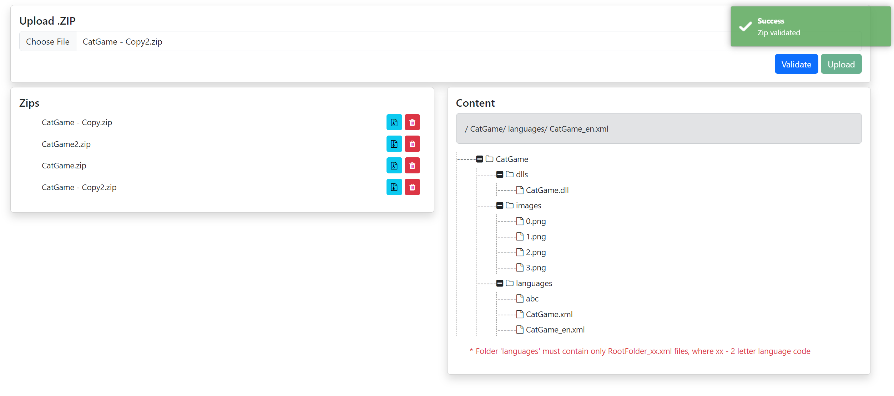

# .NET7, Vue, Bootstrap, Toastr Demo



Easiest way to run:
 - 1. Install Docker
 - 2. From project's root folder run command:
 ```
 docker compose up
 ```
 It will create container and images for backend, frontend.
 - 3. In browser type ``` http://localhost:7115/healthcheck ``` for healthcheck.
 - 4. In browser type ``` http://localhost:5175 ```. It will open Vue app.

### Example of Dependency Injection:
Program.cs
``` 
builder.Services.AddScoped<IZipService, ZipService>();
```
ZipController.cs 
```
private readonly IZipService _zipService;

public ZipController(IZipService zipService)
{
    _zipService = zipService;
}
```
 
### Example of middlewares
Program.cs
```
app.Use(next => async context =>
{
    var stopWatch = new Stopwatch();
    stopWatch.Start();

    context.Response.OnStarting(() =>
    {
        stopWatch.Stop();
        context.Response.Headers.Add("X-ResponseTime-Ms", stopWatch.ElapsedMilliseconds.ToString());
        return Task.CompletedTask;
    });

    await next(context);
});
```
This block of code adds X-ResponseTime-Ms in headers, which indicates how much time was spent in ms for execution of particular method

### Example of error handling
ZipController.cs
```
  try
  {
      List<Node> tree = _zipService.GetZipContent(zipName);
      return Ok(new { content = tree });
  }
  catch (FileNotFoundException ex)
  {
      return NotFound(ex.Message);
  }
  ```
 
 ## Project structure:
